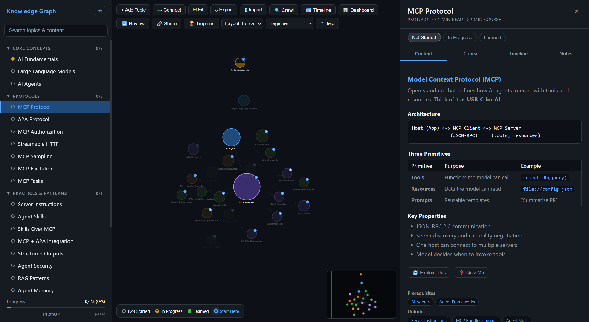

# Agent Protocols Graph

Interactive knowledge graph covering the protocols and technologies behind modern AI agents: MCP, A2A, Skills, agent frameworks, security, RAG, and more.



## Getting Started

Open [`knowledge-graph.html`](knowledge-graph.html) in any browser. No build step, no dependencies, no server required.

## Features

**Graph & Navigation**
- Force-directed graph with 23 topic nodes and 34 edges
- Left sidebar with categories, search, bookmarks, progress bar
- Glowing "Start Here" nodes show where to begin
- 4 layout algorithms: Force, Hierarchical, Radial, Circular
- Mini-map for orientation when zoomed in
- 6 built-in learning paths (Beginner, MCP Deep Dive, Agent Builder, etc.)

**Learning**
- 19 built-in courses with step-by-step lessons and quizzes
- Resizable side panel for comfortable reading
- Markdown-rendered content with code blocks, tables, lists
- Notes tab for personal annotations per topic
- Deep search across all content and course lessons
- "Explain This" / "Quiz Me" buttons to generate AI prompts

**Progress & Motivation**
- 3-state progress tracking (Not Started → In Progress → Learned)
- Spaced repetition review system with SM-2 intervals
- Course progress rings on graph nodes
- Gamification: streaks, 7 achievements, trophy case
- Progress dashboard with stats and sortable table

**Sharing & Export**
- Share progress via URL (base64-encoded)
- Export/Import full graph data as JSON
- Print courses to PDF
- Dark/Light theme toggle

**Keyboard Shortcuts**
Press `?` in the app to see all shortcuts (`j/k` navigate, `1-4` switch tabs, `s` cycle status, `r` review, etc.)

## URL Crawler

Monitor source URLs for changes and auto-generate timeline entries:

```bash
node crawler.mjs                          # crawl all monitored sources
node crawler.mjs --topic skills           # crawl one topic's sources
node crawler.mjs --add-source mcp <url>   # add a URL to monitor
node crawler.mjs --list                   # see all monitored URLs
node crawler.mjs --digest                 # save daily digest to digests/
node crawler.mjs --discord <webhook-url>  # post digest to Discord
```

### Automated daily updates

A GitHub Actions workflow runs every day at 08:00 UTC to discover sources, crawl all monitored URLs, generate a digest, and commit changes back to the repo. You can also trigger it manually from the **Actions** tab.

To enable Discord notifications, add a repository secret:

1. Go to **Settings → Secrets and variables → Actions → New repository secret**
2. Name: `DISCORD_WEBHOOK`, Value: your webhook URL

The graph is published to GitHub Pages automatically on every push to `main` and after each daily crawl.

## Topics Covered

| Category | Topics |
|----------|--------|
| Core | AI Fundamentals, Large Language Models, AI Agents |
| Protocols | MCP, A2A, MCP Authorization, Streamable HTTP, Sampling, Elicitation, Tasks |
| Practices | Server Instructions, Skills, Skills Over MCP, Structured Outputs, Agent Security, RAG, Agent Memory |
| Tools | MCP Bundles, Agent Frameworks |
| UI | Agent UIs, MCP Apps, A2UI |

## Files

| File | Purpose |
|------|---------|
| `knowledge-graph.html` | The app — fully self-contained |
| `crawler.mjs` | Node.js URL change monitor |
| `extract-data.mjs` | Extracts graph data from HTML for crawler |
| `docs/FEATURES.md` | Feature roadmap and specifications |
| `docs/main-window.png` | App screenshot for README |

## Source Material

- https://modelcontextprotocol.io
- https://a2a-protocol.org
- https://agentskills.io/specification
- https://github.com/modelcontextprotocol/experimental-ext-skills
- https://github.com/google/a2ui
